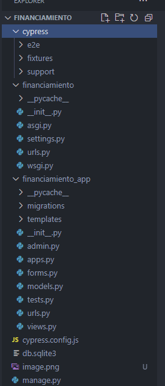
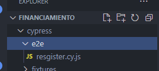
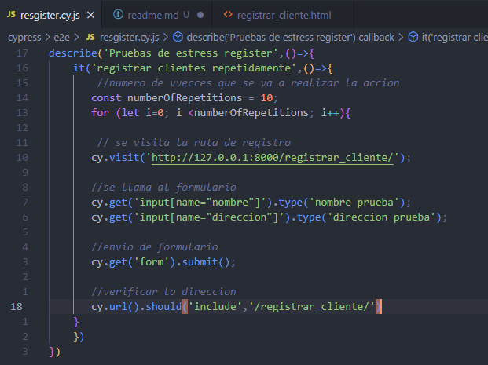
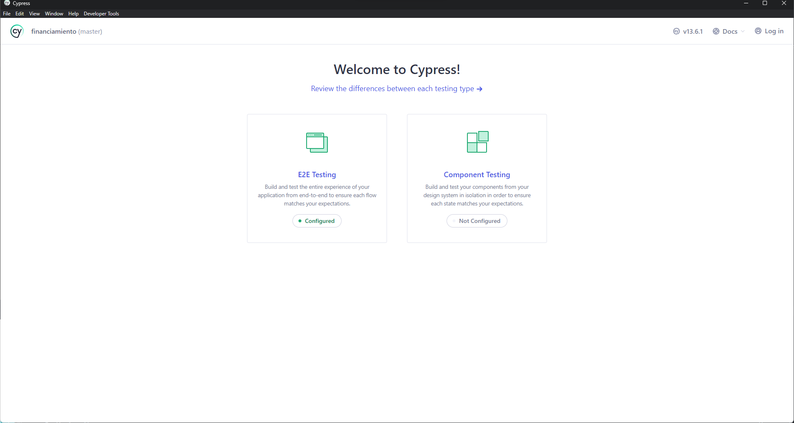
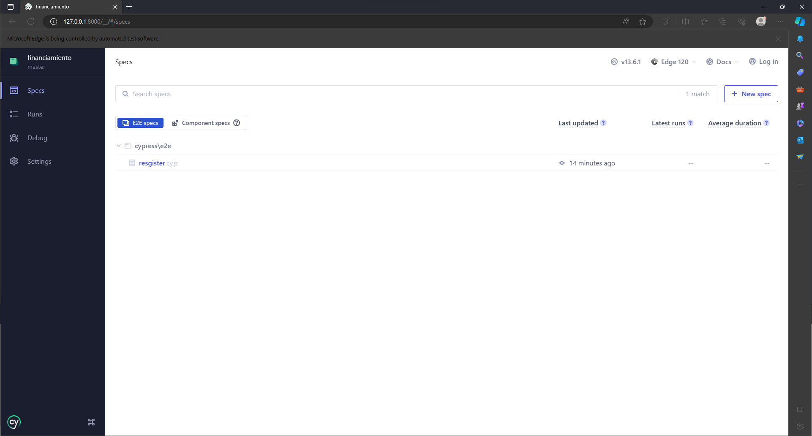
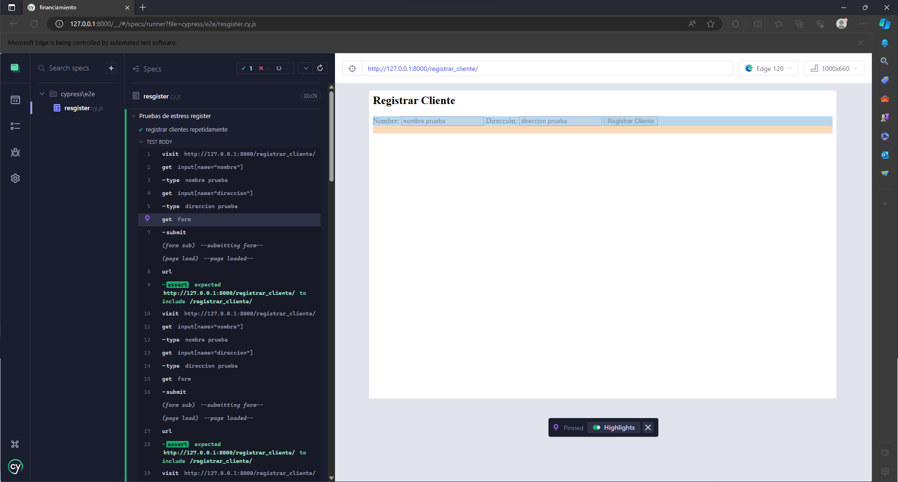
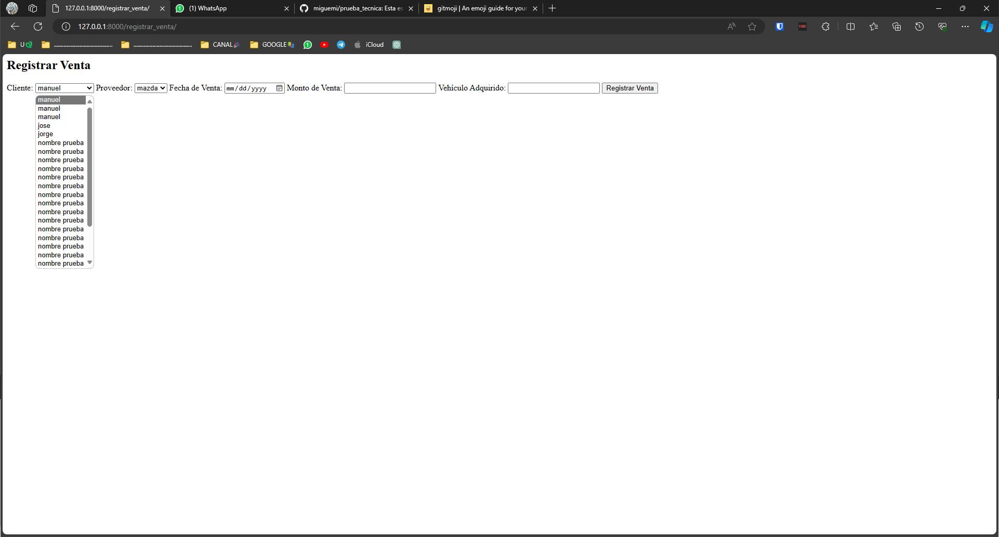

# Pasos que se llevaron para realizar la prueba
1. se crea el proyecto con el comando (django-admin startproject "nombre proyecto")
2. un cd para entrar a raiz de proyecto creado
3. se crea la app en este caso fue financiamiento_app
3. se crean los modelos para la BD
4. se crean las vistas
5. se crean los templates por cuetiones de tiempo se hizo uso de gpt para ayuda.
6. se crea el forms.py
7. se hacen las importaciones en las urls en ambos tanto para el proyecto general como para la app dentro del mismo
8. se configura el archivo setting.py
9. las migraciones se pueden hacer despues o despues del paso de los modelos
10. una vez que se haya configurado la mayor parte ya es posible ejecutar el comando 'python .\manage.py runserver' para levantar el server y ver front
## se muestra esto

# Pasos para las pruebas(test) con cypress
1. se instala cypres globalmente si no se tiene instalado
2. se inicializa en el proyecto con "npx cypress open"
### aparece la carpeta de pruebas de cypress en el proyecto

### en el directorio e2e se crean los scripts de pruebas en lenguaje js (integration)

### se configura la el test

### se levanta cypress 

7. aparecen los scripts 

# Ejecucion de test
### se ejecuta la prueba (pra registro de clientes)
- se realizaron 10 ingresos al sistema

= podemos visualizar en esta parte, ademas de las pruebas que ya se habian hecho en vivo

# Informe general de test
## Resultados

Se ejecutan con éxito 10 registros repetidos de clientes.
Cada registro incluye el llenado del formulario con información de prueba y el envío exitoso del formulario.
La URL después de cada envío del formulario se verifica para asegurar que redirige a la página de registro de clientes.

## Observaciones:
Este conjunto de pruebas está diseñado para evaluar el comportamiento del sistema bajo carga repetida.
La repetición del proceso de registro puede ayudar a identificar posibles problemas de rendimiento o estabilidad en el registro de clientes.

